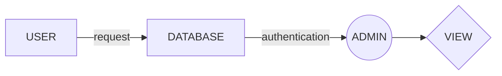

# LIBRARY MANAGEMENT SYSTEM

An app made with **Django**. This app automates tasks of a librarian and keep records organised.
 
# INSTALLATION
Create a virtual environment and install from `requierments.txt`	. This will make all dependencies install required for the project.

# FLOW CHART
Admin

Adding user

```mermaid
graph LR
